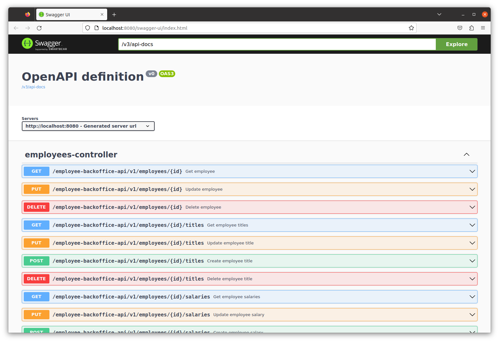

# employee-backoffice-be

This backend version of the Spring Employee-backoffice application only provides a REST API. 
There is no UI. The employee-backoffice-fe service is a Angular front-end application which consumes the REST API.

## Running employee-backoffice-be locally
### With maven
```bash
git clone https://github.com/GeorgeQuantAnalyst/employee-backoffice
cd employee-backoffice-be
mvn spring-boot:run
```

### With docker
```bash
git clone https://github.com/GeorgeQuantAnalyst/employee-backoffice
docker build --tag employee-backoffice-be employee-backoffice-be/.
docker composite up
```

You can then access employee-backoffice-be here: http://localhost:8080/swagger-ui/index.html

There are actuator health check and info routes as well:
* http://localhost:8080/actuator/health
* http://localhost:8080/actuator/info

## OpenAPI REST API documentation 
You can reach the swagger UI with this URL  http://localhost:8080/swagger-ui/index.html.



## Database configuration
In its default configuration, app uses MySql database for save data in Docker image employee-backoffice-db.
Docker image employee-backoffice-db must be running for proper functioning.

## Security configuration
Employee-backoffice-be have Basic authentication for all end-points with user and password.

```
user: user
password: password
```
