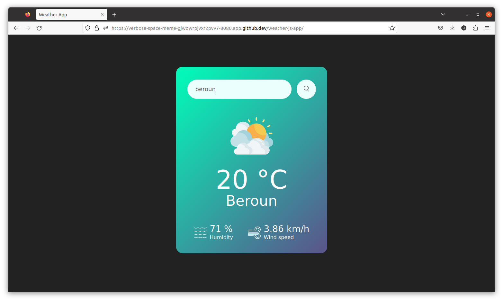
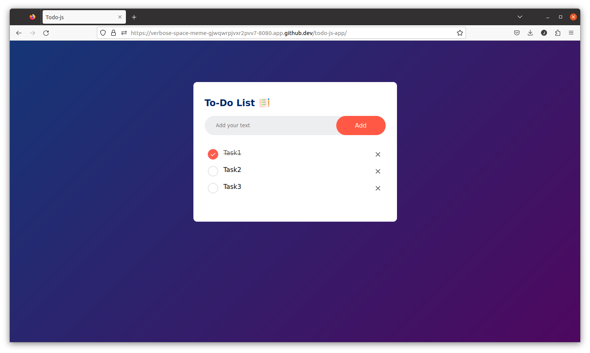
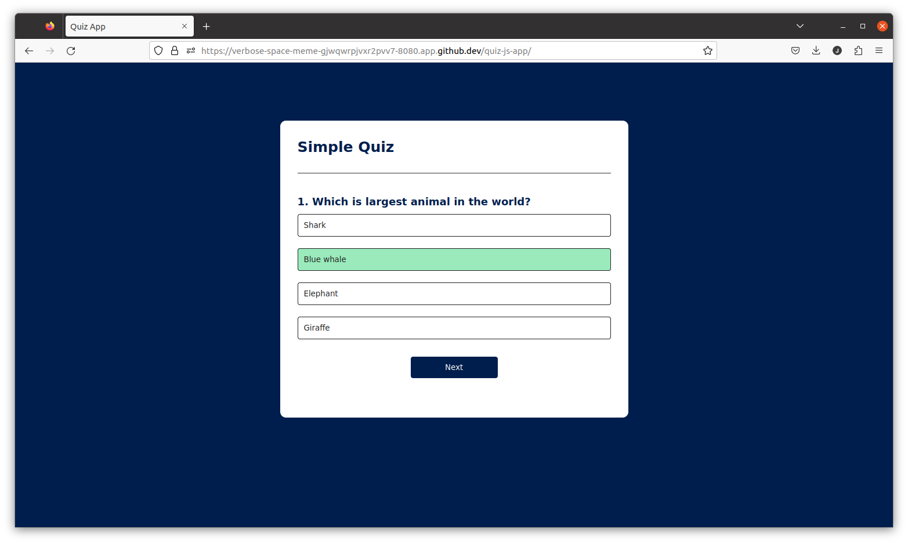
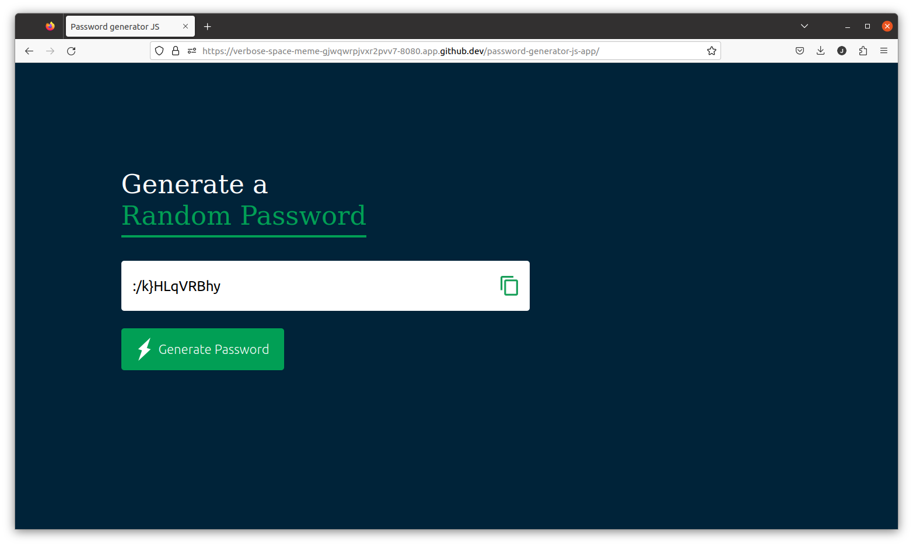
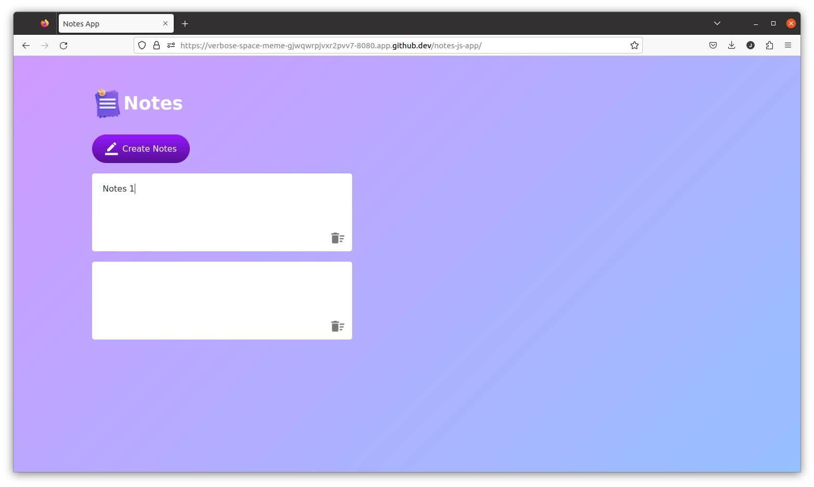

# web-apps-example
Base JavaScript projects for Resume

## weather-js-app
Weather App using HTML CSS and JavaScript. App We get the current weather data from from OpenWeatherMap and display the weather information like Temperature,  Weather condition, Humidity and Wind Speed according to the city.



**How to run**
```
npx http-server
open in browser http://127.0.0.1:8080/weather-js-app/
```

## todo-js-app
In this To Do app we can add task list and mark that task as completed or incomplete. We can write the new task in the input box and click on the "Add" button then the new task will be added to the list.
It is web app using HTML, CSS and JavaScript.



**How to run**
```
npx http-server
open in browser http://127.0.0.1:8080/todo-js-app/
```

## quiz-js-app
In this quiz app we can add multiple questions and 4 answer choices for each questions. When you select any one answer the the answer button's background color will become green if it is correct answer and the background color will become red if it is wrong answer.



**How to run**
```
npx http-server
open in browser http://127.0.0.1:8080/quiz-js-app/
```

## password-generator-js-app      
App generate a strong password with Upper case, lower case, numbers and symbols. 



**How to run**
```
npx http-server
open in browser http://127.0.0.1:8080/password-generator-js-app/
```

## notes-js-app
In this JavaScript Project we are using Local Storage  that will store the notes in your web browser, So that if you close and restart the browser then also it will display your saved notes.



**How to run**
```
npx http-server
open in browser http://127.0.0.1:8080/notes-js-app/
```

## houses-angular-app
Angular app that lists houses for rent and shows the details of individual houses. This app uses features that are common to many Angular apps (search, form, page routing, API connection).


**How to run**
```
cd houses-angular-app

npm install
json-server --watch db.json
ng serve

open in browser http://localhost:4200/
```
